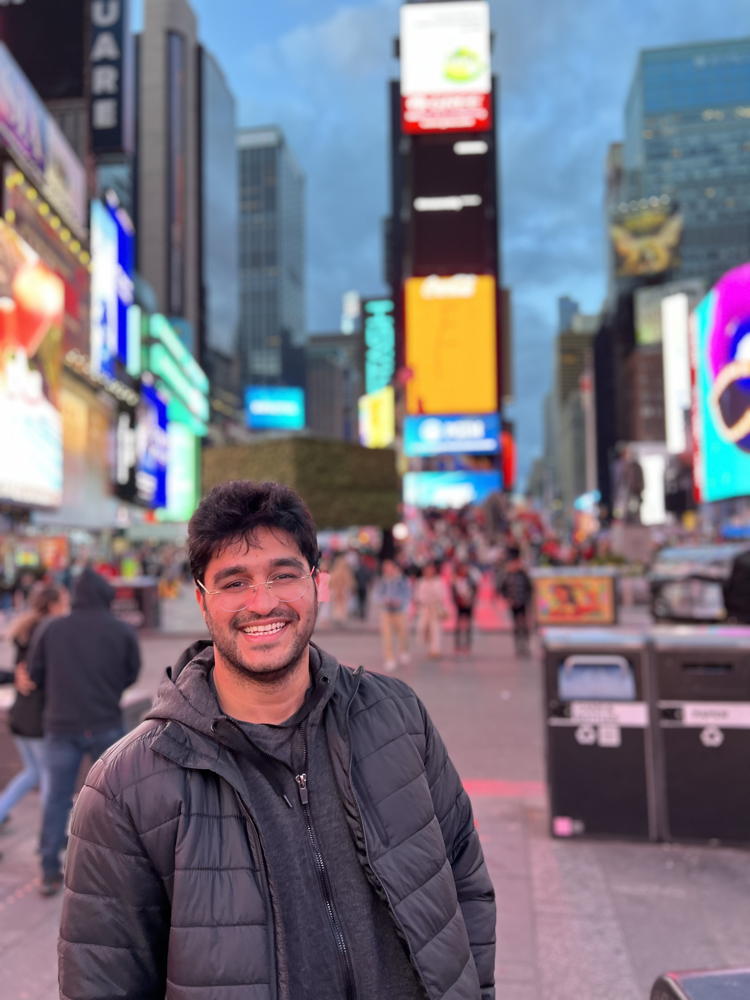

::: {.column-page}

::: {.grid}

::: {.g-col-12 .g-col-md-3}

{.rounded width="100%" style="max-width: 180px; display: block; margin: 0 auto;"}

::: {style="text-align: center; font-size: 0.85em; margin-top: 0.8em;"}
[Email](mailto:ajitkumar@umass.edu) | [GitHub](https://github.com/ajitkumar1991) | [Scholar](https://scholar.google.com/citations?user=mjxdcyMAAAAJ&hl=en) | [CV](assets/cv.pdf)
:::

:::

::: {.g-col-12 .g-col-md-9}

I develop theoretical and computational tools to understand **strongly coupled quantum field theories**. On the high-energy side, I use string theory and geometric engineering to construct and analyze four-dimensional superconformal field theories — building Lagrangian descriptions of non-Lagrangian theories, organizing IR phase diagrams, and classifying S-dual families. On the condensed-matter side, I investigate symmetry-enriched criticality and superfluidity with long-range interactions using tensor networks and Monte Carlo methods. I also study the mathematical structures of **machine learning** — transformers, diffusion models, and reinforcement learning — through the lens of statistical physics.

A unifying thread is the use of string-theoretic and conformal-field-theoretic structures — generalized symmetries, dualities, and categorical data — to illuminate physics across domains.

:::

:::

---

## Research

::: {.grid}

::: {.g-col-12 .g-col-md-6}

### The Art of Brane Bending

**Lagrangians for non-Lagrangian $\mathcal{N}=2$ SCFTs** — including the $E_6$ Minahan-Nemeschansky and Argyres-Wittig theories — via D3-branes at orientifolded toric $Y^{2,0}$ singularities. Partial resolutions flow to $\mathcal{N}=2$ fixed points, producing the $R_{2,k}$ series. Published with Heidenreich, García-Etxebarria, and Lotito.

- [Research details →](research.qmd#high-energy)
- [Brane Tilings background →](notes/brane-tilings.qmd)

:::

::: {.g-col-12 .g-col-md-6}

### Flavor Orientifolds and S-Duality

New $\mathcal{N}=1$ SCFTs from D3-branes at orientifolded singularities with **non-compact O7-planes and flavor branes**. Discrete torsion and Wilson lines yield distinct SCFTs: five inequivalent classes for $\mathbb{C}^3/\mathbb{Z}_3$, S-dual pairs for the conifold. With Heidenreich and Lotito.

- [Research details →](research.qmd#high-energy)

:::

::: {.g-col-12 .g-col-md-6}

### IR Dynamics of $\mathcal{N}=1$ Theories via Quad-CFTs

Mapping the **IR phase diagram of $SU(N)$ theories with symmetric and antisymmetric tensor matter** using quad-CFTs — strongly coupled building blocks from D5/NS5 brane tilings with an O5-plane. Resolves inconsistencies in naive deconfinement. With Heidenreich.

- [Research details →](research.qmd#high-energy)

:::

::: {.g-col-12 .g-col-md-6}

### Topological Symmetry and Boundary RG Flow

**Protected edge modes persisting at bulk Ising critical points** in interacting Majorana chains. DMRG studies of boundary RG flows across three phases with symmetry-enriched and trivial Ising transitions. Universal scaling functions for boundary flows. With Wang and Zhang.

- [Research details →](research.qmd#condensed-matter)
- [Tensor Networks background →](notes/tensor-networks.qmd)

:::

::: {.g-col-12 .g-col-md-6}

### Worm & Cluster Algorithms for Long-Range Interactions

New **worm and cluster Monte Carlo algorithms** for lattice models with Coulomb interactions. A mixed representation bypasses the $Q(k)$-function breakdown; Wolff reflections exploit density invariance. Both achieve $z \lesssim 0.2$ even with $1/r$ interactions. With Prokof'ev and Wei.

- [Research details →](research.qmd#condensed-matter)
- [Monte Carlo background →](notes/monte-carlo.qmd)

:::

::: {.g-col-12 .g-col-md-6}

### Mirror Symmetry in Quad-CFTs

The quad-CFT framework from the perspective of **type IIA mirror geometry** with D6/O6-branes. How symmetry enhancement and moduli-space structure are encoded in the mirror Calabi-Yau, providing a global geometric picture organizing field-theoretic dualities. With Pittman and Heidenreich.

- [Research details →](research.qmd#high-energy)
- [Mirror Symmetry background →](notes/mirror-symmetry.qmd)

:::

::: {.g-col-12 .g-col-md-6}

### 2D CFTs & the Weak Gravity Conjecture

**Discrete gaugings of WZW models** and orbifold CFTs: how twisted sectors reorganize the charge lattice and constrain lattice versions of the Weak Gravity Conjecture. With Heidenreich and Pittman.

- [Research details →](research.qmd#high-energy)
- [2D CFT background →](notes/2d-cft-swampland.qmd)

:::

::: {.g-col-12 .g-col-md-6}

### Impurity Dynamics in Dirac Fermion Systems

How a localized impurity interacts with a bath of **massless Dirac fermions** --- modified Kondo physics due to the vanishing density of states at the Fermi level. Published with Sarkar and Gangadharaiah.

- [Research details →](research.qmd#condensed-matter)

:::

:::

---

## Featured Notes

Technical expositions on the methods and frameworks underlying my research:

::: {.grid}

::: {.g-col-12 .g-col-md-6}

**Physics & Mathematics**

| | |
|:--|:--|
| **[Brane Tilings](notes/brane-tilings.qmd)** | Geometric engineering, orientifolds, Seiberg duality |
| **[Tensor Networks](notes/tensor-networks.qmd)** | MPS, DMRG, entanglement entropy, TCI, holography |
| **[Monte Carlo Methods](notes/monte-carlo.qmd)** | Metropolis, cluster, worm algorithms, error analysis |
| **[2D CFT & Swampland](notes/2d-cft-swampland.qmd)** | Virasoro algebra, modular invariance, orbifolds |
| **[Mirror Symmetry](notes/mirror-symmetry.qmd)** | Calabi-Yau pairs, T-duality, SYZ conjecture |
| **[Quantum Foundations](notes/quantum-foundations.qmd)** | Quantum eraser, decoherence, Everettian QM |
| **[Measurement-Induced Transitions](notes/measurement-induced-transitions.qmd)** | Entanglement transitions, monitored circuits, QEC |

: {tbl-colwidths="[40,60]"}

:::

::: {.g-col-12 .g-col-md-6}

**Machine Learning & Computation**

| | |
|:--|:--|
| **[Machine Learning](notes/machine-learning.qmd)** | Neural nets, diffusion models, normalizing flows, grokking |
| **[Deep Learning Architectures](notes/deep-learning-architectures.qmd)** | RNNs, CNNs, LSTMs, attention, transformers |
| **[Large Language Models](notes/large-language-models.qmd)** | Scaling laws, RLHF, emergent abilities, chain-of-thought |
| **[Reinforcement Learning](notes/reinforcement-learning.qmd)** | MDPs, policy gradients, PPO, actor-critic |
| **[Computational Applications](notes/computational-applications.qmd)** | MC in finance, tensor networks for data, RMT |
| **[Group Theory in QM](notes/group-theory-qm.qmd)** | Representations, symmetry, Clebsch-Gordan |

: {tbl-colwidths="[40,60]"}

:::

:::

Browse [all 14 notes](notes/index.qmd) or explore the [Computational Methods](tools/index.qmd).

---

## Latest from the Blog

- **[Zeta Regularization and Vacuum Energy](blog/2025-11-15-zeta-regularization.qmd)** (Nov 2025) — How $\zeta(-1) = -1/12$ controls the vacuum energy in 2D CFT and determines $D=26$.

- **[On Being an Interdisciplinary Physicist](blog/2024-12-01-interdisciplinary.qmd)** (Dec 2024) — Reflections on working across string theory, condensed matter, and computation.

[See all posts →](blog/index.qmd)

:::
